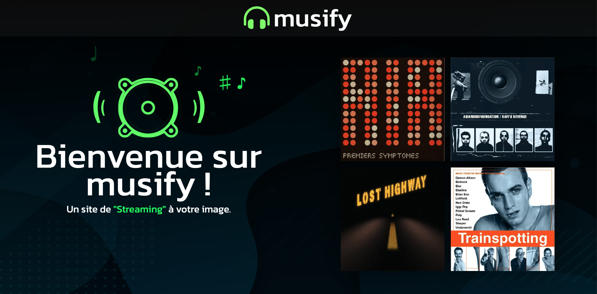

# Projet Final Web 2
## Guide détaillé pour la création d'un portail numérique

### Exemple
<https://prof-inter-web.github.io/Musify/index.html>

Le projet consiste à développer un portail numérique de type application. 
> [!IMPORTANT]
> L'évaluation se fera sur la `créativité` et la capacité à rendre le portail `"responsive"`.

Le portail doit comprendre une page d'accueil et trois autres pages en lien avec le thème choisi parmi les options suivantes :

- Voyageurs Temporels dans un Univers Virtuel
- Cité Cachée au Cœur de la forêt amazonienne
- École de Magie
- Agence de Voyage Spatio-Temporelle
- Cirque
- Magasin de disque
- etc.

### Page d'Accueil:

Lorsque l'utilisateur accède au portail, il doit être dirigé vers une page d'accueil comportant les éléments suivants :

- Un logo représentatif du thème choisi.
- Un menu de navigation.
- Une ou plusieurs animations.
- Fond d'écran (image ou dégradé).
- Importation d'une police d'écriture.
- Création de variables CSS.
- Application d'un filtre.
- Utilisation d'un mode de fusion.
- Positionnement du logo avec CSS.
- Intégration de transitions (par exemple, rotation, etc.).
- Le menu peut être composé d'images ou de mots.
- Utilisation de Pseudo-Classes.
- Utilisation de Media Queries pour assurer la compatibilité avec différents appareils.

### Trois Autres Pages:

Chacune de ces pages doit inclure :

Le menu de navigation pour permettre à l'utilisateur de passer d'une page à l'autre.
Déconstruction d'une image (images ou SVG) en plusieurs images pour appliquer des animations, transitions et transformations.
Pour chaque page :

- Fond d'écran (image ou dégradé).
- Importation d'une police d'écriture.
- Création de variables CSS.
- Application d'un filtre.
- Utilisation d'un mode de fusion.
- Positionnement du logo avec CSS.
- Intégration de transitions (par exemple, rotation, etc.).
- Le menu peut être composé d'images ou de mots.
- Utilisation de Pseudo-Classes.
- Utilisation de Pseudo-Éléments.
- Utilisation de Media Queries pour assurer la compatibilité avec différents appareils.

#### Vous disposez de trois pages à concevoir : l'une devra incorporer la pseudo-classe, une autre l'aspect-ratio, et la troisième devra utiliser la pseudo-classe :has.
- Utilisation avancée de Pseudo-Classes dans une page.
- Inclusion d'un aspect-ratio dans une autre page.
- Utilisation de la pseudo-Classe :has dans une troisième page.

## Finalisation:

Au total, vous devez créer quatre pages en utilisant les outils et techniques enseignés dans le cours. Cela inclut la création du code HTML et la préparation des images à l'aide de logiciels tels que Photoshop, Illustrator ou tout autre outil compatible avec SVG. 

> [!WARNING]
> Ce projet compte pour 40% de votre session, donc assurez-vous de faire preuve de `créativité et de dynamisme` (animées) dans la conception de vos pages.

## Remise

1. Renommez votre dossier "Projet_Final_[nom]_[prenom]".
2. Zippez votre dossier "Projet_Final_[nom]_[prenom]".
3. Joignez votre fichier .zip au devoir "EX03: Projet Final".

## Bon travail ! 😊
